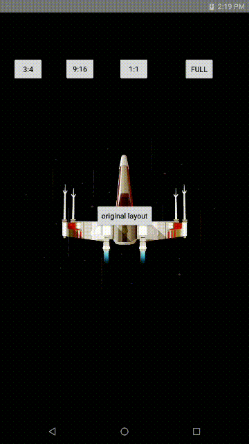

# AndroidPracticeSet项目

## 项目简介

日常工作中可能会有一些功能需求，如果直接在原有项目中进行测试，可能会由于项目比较大导致调试耗时，因此会另外建立小的工程来实现功能，这个项目集合就是用来存放日常实现功能的一些工程。

## 项目内容

### BlurryTest

#### BitMap模糊+Animation动画

在相机切换分辨率的时候需要增加一些动画：先模糊，然后加入拉伸和改变Alpha通道的动画。

项目名：**BlurryTest**

效果：

### AlBumTest

#### 打开系统相册保存图片通知刷新

功能：打开系统相册选择图片并显示，保存获取到的图片到指定目录并通知系统相册更新。

效果：

#### ViewPager显示指定目录下图片

功能：在指定目录下打开JPEG文件，并用`ViewPager`显示，`ActionBar`显示每张图最后被修改的时间。

效果如下：

